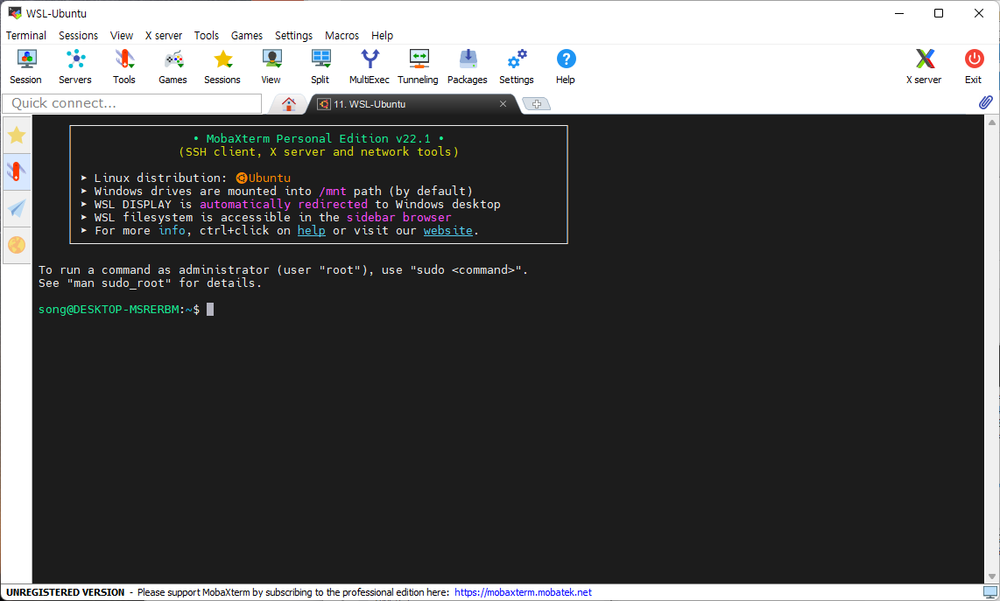

# < 시작전에 >


# 1. 실습 환경 준비

우리는 Local 환경에서 Docker-Desktop 를 이용하여 Image build 및 RUN 을 통한 실습과 

Public Cloud 인 AWS 기반 ECR,EKS 등의  환경에서 Kubernetes 상 CI/CD 과정에 대해 각종 실습을 진행할 것이다.

이를 위한 아래 프로그램들을 설치하여 교육진행을 원할히 할 수 있도록 하자.


### 1.1 AWS-CLI 2 설치

* 다운로드 경로 : https://docs.aws.amazon.com/ko_kr/cli/latest/userguide/getting-started-install.html

  ```sh
  $ aws configure 
  AWS Access Key ID [None]: <발급한 Key id>
  AWS Secret Access Key [None]: <발급한 Secret Access Key>
  Default region name [None]: 
  Default output format [None]:
  
  ```

  


## 1.1 MobaxTerm 설치

Cloud VM에 접근하기 위해서는 터미널이 필요하다.

CMD / PowerShell / putty 와 같은 기본 터미널을 이용해도 되지만 좀더 많은 기능이 제공되는 MobaxTerm(free 버젼) 을 다운로드 하자.


- download 위치
  - 링크: https://download.mobatek.net/2312023031823706/MobaXterm_Installer_v23.1.zip

- mobaxterm 실행




## 1.2 gitBash 설치

교육문서를 다운로드 받으려면 Git Command 가 필요하다. Windows 에서는 기본 제공되지 않아 별도 설치 해야 한다.

- 다운로드 주소 : https://github.com/git-for-windows/git/releases/download/v2.40.1.windows.1/Git-2.40.1-64-bit.exe
- 참조 링크 : https://git-scm.com/


## 1.3 Typora 설치

교육자료는 MarkDown 문서로 되어 있으며 MD 파일을 확인하기 위해서  typora를 설치 한다.


### (1) 설치

- download 위치
  - 다운로드주소 : https://download.typora.io/windows/typora-setup-x64.exe


- [참고] 링크: https://typora.io/


- Typora 실행


### (2) Typora 환경설정

원할한 실습을 위해 코드펜스 옵션을 아래와 같이 변경하자.

- 코드펜스 설정
  - 메뉴 : 파일 > 환경설정 > 마크다운 > 코드펜스
    - 코드펜스에서 줄번호 보이기 - check
    - 긴문장 자동 줄바꿈 : uncheck


- 개요보기 설정
  - 메뉴 : 보기 > 개요
    - 개요 : check


## 1.4 wsl2(필수)

본인 PC 에 WSL이 설치되어 있는지 확인하자.


### (1) 확인 하는 방법

command 창에서 wsl 명령으로 설치여부를 확인 할 수 있다.

```sh
> wsl -l -v 
```


- 만약 version 이 1 이라면 아래와 같이 update 한다.
  - 참고링크
    - https://docs.microsoft.com/en-us/windows/wsl/install
    - https://docs.microsoft.com/ko-kr/windows/wsl/install-manual
  - PowerShell 실행

```sh
> wsl --install

> wsl --set-version Ubuntu 2

# 기본값으로 설정 변경해도 됨
> wsl --set-default-version 2

# 강제 재기동
> wsl -t Ubuntu

```


- linux 가 설정안되어 있다면

```sh
1. Microsoft Store를 열고 즐겨 찾는 Linux 배포를 선택
   - Ubuntu 20.04.1 LTS

2. 배포 페이지에서 "다운로드"를 선택

3. 사용자 계정 및 암호 생성

```


### (2) WSL 실행하는 방법

실행하는 방법은 아래와 같이 다양하다. 본인이 편한 방법을 선택하자.

1. cmd 창에서 바로실행
   - cmd 창에서 `wsl` 명령을 입력하면 바로 default linux 가 실행된다.
   - `wsl -u root` 명령으로 root 로 실행 할 수 있다.


2. windows 터미널 으로 실행하는 방법

   - windows 터미널 설치 : https://docs.microsoft.com/ko-KR/windows/terminal/get-started


### 1.5  Docker Desktop 설치(필수)

- 다운로드 주소 : https://www.docker.com/products/docker-desktop/


### 1.6 Hosts 설정

* hosts 파일이란 **IP 주소와 도메인 주소를 매핑해주는 파일**이다.

* 보통, 주소창에 도메인으로 접속을 하면 DNS 서버를 통해 이에 대응하는 IP 주소를 찾아서 서버에 접속하게 된다. 이때 hosts 파일에 도메인과 IP를 임의로 지정하게 되면 DNS 서버보다 우선된다.

* 실습중 Public Cloud 에 Jenkins,Argocd 및 각종 언어로된 웹서버를 provisioning 할 예정이다 도메인등록이 되지 않은 상태이므로 로컬환경에서 도메인을 인식 할 수 있도록 아래와 같이 hosts(관리자 권한으로 실행) 파일을 수정해준다

  ```sh
  #경로 C:\Windows\System32\drivers\etc\hosts
  
  15.165.54.43 ${USER_IDENTITY}-jenkins.com
  15.165.54.43 ${USER_IDENTITY}-argocd.com
  15.165.54.43 ${USER_IDENTITY}-spring.com
  15.165.54.43 ${USER_IDENTITY}-python.com
  15.165.54.43 ${USER_IDENTITY}-express.com
  ```

  


# 2. 교육문서 Download

해당 교육문서는 모두 markdown 형식으로 작성되었다.  Chrome Browser 에서 github 문서를 직접 확인해도 된다.

하지만 실습을 따라가다 보면 개인별로 수정해야 할 부분이 있는데 web browser 에서는 수정이 안되기 때문에 수정이 용이한 환경이 훨씬 좋을 것이다.

좀더 효율적인 실습을 위해서 해당 자료를 download 하여 markdown 전용 viewer 인 Typora 로 오픈하여 실습에 참여하자.


## 2.1 교육문서 Download

gitbash 실행후 command 명령어로 아래와 같이 임의의 디렉토리를 생성후 git clone 으로 download 하자.

```sh
# GitBash 실행

# 본인 PC에서 아래 디렉토리를 생성
$ mkdir -p /c/edu
 
 
$ cd /c/edu

$ git clone https://github.com/jssss93/edu_cicd.git
Cloning into 'ktds-edu-cloud-cicd'...
remote: Enumerating objects: 590, done.
remote: Counting objects: 100% (41/41), done.
remote: Compressing objects: 100% (26/26), done.
remote: Total 590 (delta 17), reused 28 (delta 13), pack-reused 549
Receiving objects: 100% (590/590), 8.70 MiB | 9.77 MiB/s, done.
Resolving deltas: 100% (259/259), done.


```


만약 교육중 (오타 변경 등의 사유로) 자료가 변경되어 다시 받아야 하는 경우 가 있을 경우 해당 위치에서 git pull 만 다시 받도록 하자.

```sh
$ cd /c/edu/ktds-edu-cloud-cicd

$ git pull


# 만약 Download 받은자료를 수정되어서 pull 이 안되는 경우는 
# stash 후 pull 받자.
# stash 는 내가 수행한 작업을 commit 하기전 임시로 저장해 놓는 명령이다.

$ git stash

$ git pull

```


## 2.2 Typora 로 readme.md 파일오픈

- typora 로 오픈

```
## typora 에서 아래 파일 오픈

C:\edu\edu-cicd\README.md
```


# 3. 실습 환경 준비(Cloud)


## 3.1 개인별 USER_IDENTITY 확인

${USER_IDENTITY} 는 사용자별로 Kubernetes Namespace , ECR TAG 등을 구분 하기 위한 값으로 모든 교재마다 Replace(Ctrl+F) 처리 하여 실습을 진행한다


|  NO  | 담당자 |        소속         | USER_IDENTITY | 비고 |
| :--: | :----: | :-----------------: | :-----------: | :--: |
|  1   | 최종수 | ICIS  Tr 아키텍처팀 |    user01     |      |
|  2   |        |                     |    user02     |      |
|  3   |        |                     |    user03     |      |
|  4   |        |                     |    user04     |      |
|  5   |        |                     |    user05     |      |
|  6   |        |                     |    user06     |      |
|  7   |        |                     |    user07     |      |
|  8   |        |                     |    user08     |      |
|  9   |        |                     |    user09     |      |
|  10  |        |                     |    user10     |      |
|  11  |        |                     |    user11     |      |
|  12  |        |                     |    user12     |      |
|  13  |        |                     |    user13     |      |
|  14  |        |                     |    user14     |      |
|  15  |        |                     |    user15     |      |
|  16  |        |                     |    user16     |      |
|  17  |        |                     |    user17     |      |
|  18  |        |                     |    user18     |      |
|  19  |        |                     |    user19     |      |
|  20  |        |                     |    user20     |      |
