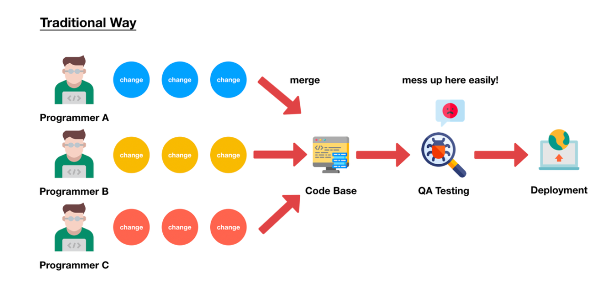
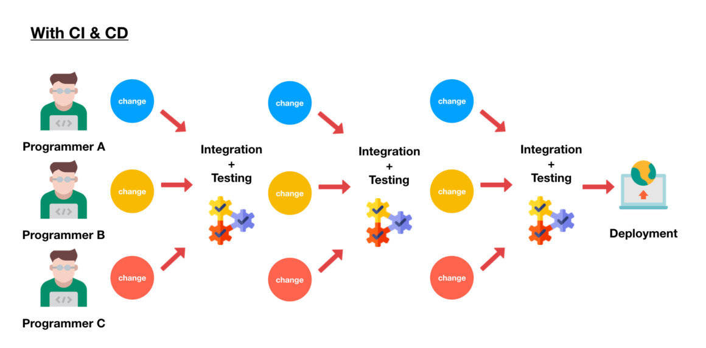

# CI/CD 

## 1. CI/CD 개요

지속적 통합(Continuous integration, CI)과 지속적 제공(Continuous delivery or Continuous Deployment, CD), 줄여서 CI/CD는 애플리케이션 개발팀이 더 자주, 안정적으로 코드 변경을 제공하기 위해 사용하는 문화와 운영 원칙 이며 일련의 작업 으로 구성됩니다. 

CI/CD는 데브옵스팀을 위한 권장 사항이자 애자일 방법론의 권장 사항이기도 합니다. CI/CD는 통합과 제공을 자동화함으로써 소프트웨어 개발팀이 코드 품질과 소프트웨어 보안을 보장하는 동시에 비즈니스 요구사항을 충족하는 데 집중할 수 있게 해줍니다.  

주요 개념은 지속적인 통합, 지속적인제공 및 지속적인 배포입니다.CI/CD는 새로운 코드를 통합할 때 개발 및 운영 팀에 발생할 수 있는 문제를 미리 대처 하는 솔루션 중 하나입니다 또한 지속적인 자동화와 지속적인 모니터링에 대한 개념을 포함합니다.


---

수많은 앱과 서비스가 출시되는 요즘 시대에 소프트웨어 프로젝트는 점점 복잡해지고 거대해져 갑니다.

사용자들의 요구에 맞게 더 많고, 편리한 기능을 제공하기 위해 꾸준한 업데이트와 신규 서비스가 출시되고 있으며 

수많은 기능들이 요구됨에 따라, 각각의 기능을 분리하는 *Micro Service Architecture*가 유행하기 시작했습니다.

효율적인 생산성을 위해, 서로 다른 개발자들이 각자 맡은 기능을 구현하게 되고 이를 하나로 합쳐 사용자들에게 전달하게됩니다.

그에 따라 유지/보수에도 많은 노력이 필요하게 됩니다.

각각 다른 환경에서, 다른 사람이 개발한 코드를 **1) 합치고, 2) 빌드하고, 3) 테스트**하는 과정은 번거롭고 시간을 많이 잡아먹습니다. 

개발자들은 귀찮은 것을 매우 싫어하는 사람들이기에 이렇게 생각했습니다.

> *이걸 굳이 사람이 일일이 해야 할까?*
> *코드를 Commit 함과 동시에 통합, 빌드하고 배포까지 자동화할 수 없을까?*

이를 바탕으로, 자동으로 그리고 지속적으로 통합하고(CI), 배포하는(CD) 기능들을 구축하기 시작합니다.


## 2 CI/CD의 의미 

### 2.1 지속적인 통합(Continuous Integration)

CI는 **Continuous Integration** 즉, 지속적인 통합이라는 의미이며 

지속적인 통합이란,어플리케이션의 **새로운 코드 변경 사항이 정기적으로 빌드 및 테스트 되어 공유 레포지토리에 통합히는 것을 의미**합니다. (가능하다면 하루에 여러번까지)


지속적 통합은 개발팀이 작은 코드 변경을 수시로 구현해 버전 제어 리포지토리에 통합하도록 유도하는 코딩 원칙이자 일련의 방식입니다. 대부분의 현대 애플리케이션에서는 다양한 플랫폼과 툴을 사용해 코드를 개발해야 하므로 개발팀 및 운영팀은 변경을 통합하고 검증할 일관적인 메커니즘이 필요합니다. 지속적 통합은 애플리케이션을 빌드, 패키징, 테스트하기 위한 자동화된 방법을 구축합니다. 일관적인 통합 프로세스를 두면 개발자는 자연스럽게 더 자주 코드 변경을 커밋하게 되고 이것이 더 나은 협업과 코드 품질로 이어집니다. 


최신 애플리케이션 개발에서의 목표는 여러 개발자가 동일한 앱의 서로 다른 기능에 대해 동시에 작업하도록 하는 것입니다. 그러나 조직이 하루에 모든 분기 소스 코드를 함께 병합하도록 설정된 경우, 작업은 지루하고 수동적이며 시간이 많이 소요될 수 있습니다. 고립된 상태에서 작업하는 개발자가 응용 프로그램을 변경하면 여러 개발자가 동시에 수행하는 변경 사항들과 충돌할 가능성이 있기 때문입니다.팀이 하나의 IDE 에 동의하지 않고 개발자가 각각의 IDE를 사용하는 경우 이 문제는 더욱 복잡해질 수 있습니다 .

> CI 개발자는 정기적으로 (최소한 매일) 모든 작업을 Master-Branch에 통합한다.

이 인용구에는 CI 관행의 두 가지 기본 원칙이 숨어 있습니다. 첫 번째는 "모든 작업을 Trunk에 통합"이고, 두 번째는 "최소한 매일"입니다.

또한 소스 저장소에서 모든 것을 확인, 빌드 자동화, 빌드 속도를 빠르게 유지, 자체 테스트 코드 보유, 눈에 보이는 오류를 표시하고 즉각적인 수정과 같은 CI를 만드는 다양한 원칙과 관행도 있습니다. 디테일한 내용은 마틴 파울러님이 작성하신 **[포스팅](https://martinfowler.com/articles/continuousIntegration.html)**을 참고하시길 바랍니다. 


##### CI에 대한 4가지 규칙

주의할 점은 CI 도구를 도입했다고 해서 CI를 하고 있다는 것은 아니다. 마틴 파울러의 블로그에서는 CI에 대해 아래와 같은 4가지 규칙을 이야기한다.

1. 모든 소스코드가 실행가능하며, 모든 사용자가 **가장 최신 소스코드에 접근할 수 있는 단일 지점을 유지**할 것(master,develop)
2. 누구나 **단일 명령을 사용하여 빌드**할 수 있도록 빌드 프로세스를 자동화할 것
3. **단일 명령으로 언제든지 테스트**를 실행할 수 있도록 할 것
4. 누구나 현재 실행 파일을 얻으면 지금까지 가장 완전한 실행 파일을 얻었다는 **확신**을 하게 할 것


---


### 2.2 지속적인 전달(Continuous Delivery)

빌드 자동화와 CI의 단위 및 통합 테스트에 이어 지속적 전달은 **검증된 코드를 리포지토리로 자동 릴리즈**합니다. 따라서 효과적인 지속적 전달 프로세스를 갖기 위해서는 CI가 이미 개발 파이프라인에 구축되어 있어야 합니다. 지속적 전달의 목표는 **항상 운영환경에 배포할 준비가 된 코드를 갖는 것**입니다.

지속적 전달에서는 코드 병합에서 프로덕션 준비 빌드 제공에 이르기까지 모든 단계에 테스트 자동화 및 코드 릴리스 자동화가 포함됩니다. 해당 프로세스가 끝나면 운영 팀은 앱을 프로덕션에 빠르고 쉽게 배포할 수 있습니다.

---


### 2.3 지속적인 배포(Continuous Deployment)

고도화된 CI/CD 파이프라인의 마지막 단계는 지속적인 배포입니다. 코드 리포지토리에 대한 프로덕션 준비 빌드 릴리스를 자동화하는 지속적 전달의 확장으로서 지속적 배포는 **어플리케이션을 프로덕션으로 릴리즈하는 것을 자동화**합니다. 

실제로 지속적인 배포는 클라우드 애플리케이션에 대한 개발자의 변경 사항이 작성 후 몇 분 안에 실행될 수 있음을 의미합니다(테스트 포함). 이를 통해 사용자로부터 피드백을 지속적으로 받고 개선하는 것이 훨씬 쉬워집니다. 

종합하면 이러한 모든 연결된 CI/CD 사례는 애플리케이션 배포의 위험을 줄여주며 앱에 대한 변경 사항을 한 번에 모두 릴리스하는 것보다 작은 조각으로 릴리스하는 것이 더 쉽습니다. 하지만 CI/CD 파이프라인의 다양한 테스트 및 릴리스 단계를 수용하려면 자동화된 테스트 또한 작성해야 하므로 선행 투자도 많이 필요합니다.


CD는 CI와 함께 사용하며, CI과정에서 빌드와 테스팅이 완료된 코드를 사용자에게 지속적으로 배포하는 과정을 의미합니다. **배포 준비 및 실제 배포를 자동화되지 않은 별도의 트리거등을 통해 수동으로 한다면 Continuous Delivery, 이 과정을 자동화하면 Continuous Deployment**라고 부릅니다.

**Continuous Delivery**는 공유 레포지토리로 자동으로 Release 하는 것,
**Continuous Deployment**는 Production 레벨까지 자동으로 deploy 까지 하는 것을 의미합니다.

정리하자면, CI가 **변경된 소스코드의 빌드, 테스트, 병합까지를 의미**하며, CD는 **개발자의 변경 사항이 레포지토리를 넘어, 고객과 맞닿은 프로덕션(Production) 환경까지 릴리즈 되는 것**을 의미합니다.

CI에서 예로 든 MSA와 같은 환경에서 Agile 방법론이 적용될 경우,**서비스의 사용자는 최대한 빠른 시간 내에 최신 버전의 Production을 제공받을 필요가 있으며 개발자는 이를 제공 할 의무가 있습니다.
**이 때, 소프트웨어가 언제든지 신뢰 가능한 수준의 버전을 유지할 수 있도록 서포팅 하는 것이 CD라고 할 수 있습니다 .CD는 서비스의 배포에 이르기까지의 노력을 최소한으로 단축시켜 준다는 이점을 제공합니다.

 

---


## 3 CI/CD를 왜 사용해야 하는가?

### 3.1 CI/CD 필요 배경

* **다수의 개발자가 형상관리 툴을 공유하여 사용하는 환경**
  지속적으로 서비스해야 하는 어플리케이션이나 현재 개발 중인 어플리케이션은 기능 추가 시마다 Pull Request 등을 날려 레포지토리(Repository)에 버전 업데이트를 합니다. 다수의 개발자가 한 팀으로 작업할 경우, 이 공유 레포지토리에 수많은 commit들이 쌓이게 됩니다. 그럴 때마다, 기능별로 빌드/테스트/병합(Merge)까지 하려면 상당히 번거롭습니다. 이런 상황에서, **자동화된 빌드&테스트**는 **원천 소스코드의 충돌 등을 방어**하는 이점을 제공할 수 있습니다.

* **MSA(Micro Service Archietecture) 환경**
  기존의 어플리케이션이 모든 기능을 포함하는 하나의 거대한 모놀리틱 서비스였다면, **MSA는 작은 기능 및 특정 기준점으로 서비스를 잘게 쪼개어 개발하는 형태를 의미**합니다.
  
  매번 코드를 업데이트 하기 위해서 서버에 접속해서 돌아가는 서비스를 kill 하고 git에서 pull한뒤 build하고 다시 서비스를 올리기 까지 많은 과정이 필요합니다. 물론 서버가 하나라면 불편함을 느끼지 못할 수 도 있습니다. 또한 서버가 내려가 있는 시간이 길어진다는 문제가 발생합니다. 만약 코드변경시 업데이트 해야하는 서버가 하나가 아니라 여러개라면? 매번 모든 서버에 들어가서 업데이트를 해야할까요? 효율성을 추구하는 개발자로써 이것은 엄청난 비효율을 야기합니다.
  
  사용자에게 우리가 만들어낸 프로젝트를 배포했는데 어떠한 동작이 올바르게 동작하지 않아 문제가 발생했다고 가정해봅니다.개발자들에게는 비상이 걸릴 것입니다. 급한 프로젝트일수록 문제 발생시 빠르게 수정해야만 합니다. 수정을 했으면 다시 컴파일, 빌드, 배포하는 과정을 통해 수정된 코드가 제대로 동작하는지 테스트하고 검증할 필요가 있습니다. 이 과정들은 시간도 많이 걸리고 실수하기도 쉽습니다.
  
  MSA 환경에서는 대부분 **Agile**(소규모 기능 단위로 빠르게 개발 & 적용을 반복하는 개발방법론) 또는 **부분적인 Agile**방법론이 적용되기 때문에, 기능 추가가 매우 빈번하게 발생하게 됩니다. 작은 Micro Service간 상호 테스트도 중요해집니다 그러한 상황에서 CI/CD의 적용은 **기능 충돌 방지, 버그를 신속하게 찾아 해결하고, 소프트웨어의 품질을 개선하고, 새로운 업데이트의 검증 및 릴리즈의 시간을 단축시키는 것** 등의 다양한 이점을 제공할 수 있습니다.


---


### 3.2 CI/CD 자동화의 이점

CI/CD를 위한 파이프라인을 구성하는 DevOps 엔지니어는 이를 자동화 단계까지 끌어 올립니다.
또한 중간중간 모니터링 지표를 구성하여, 개발자들의 개발 방향을 가이드하죠. 이를 통하여, 고객들에게 안정적이고 신뢰성 높은 서비스 프로덕션을 제공합니다.

서비스 제품을 개발하는 일도 중요하지만, **고객에게 안정감 있는 서비스를 배포하여 운영하는 일**도 중요합니다.


앞서 말했듯 CI/CD의 핵심은 가능한 작은 단위로 빠르고, 자주 코드를 병합하고, 병합된코드를 테스트하고, 테스트한 코드를 빌드하여 사용자에게 서비스를 제공하는 것, 그리고 이 과정을 자동화하는 것에 있습니다. 이런 특징으로 우리는 어떤 이점을 얻을 수 있을까요?


* **더 적은 버그와 오류**

코드를 가능한 작은 단위로 자주 커밋하므로 버그를 조기에 발견하고, 롤백할 수 있습니다. 따라서 좀 더 매끄러운 개발 과정 속에서 팀 스트레스를 줄일 수 있습니다. 또한 이를 통해 프로덕션 코드는 기존에 비해 더 적은 오류를 가지고 있으며 고객 만족도도 증가합니다.

* **가치 실현 기간 단축**

CI/CD를 사용하면 자주 새로운 기능을 고객에게 더 빨리 출시하여 경쟁 우위를 확보할 수 있습니다. 즉 가치 실현 기간을 단축할 수 있습니다.

* **개발자의 행복**

개발자는 적지 않은 시간을 테스트, 코드 디버깅등에 사용한다고 합니다. 빌드, 테스트, 배포와 같이 반복되는 지루한 과정을 개발자가 직접 하지 않고, 자동화함으로써 개발자는 조금 더 핵심적이고 중요한일에 소중한 시간을 할애할 수 있습니다.


---


### 3.3 CI/CD 사용 전/후 프로세스 비교

#### CI/CD 적용 전



1. 개발자들이 코드를 작성합니다.
2. 각자의 브랜치에 변경한 코드를 push합니다.
   - 이때 에러가 발생하더라도 눈치챌 수 없습니다.
3. 각자의 코드를 git에 올리고 merge합니다.
4. 에러가 발생하면 1번으로 돌아가서 디버깅하여 에러를 찾고 코드를 수정합니다.
   - 이때 코드의 양이 많다면 에러 추적이 쉽지 않습니다.
5. 1~4의 과정을 반복합니다.
6. 에러를 해결했다면 배포를 직접 진행합니다.


---


#### CI/CD 적용 후



1. 개발자들이 코드를 작성합니다.
2. 각자의 브랜치에 코드를 push합니다.
3. push를 통해 trigger되어 CI 서버에서 **자동으로** build, test, lint를 실행하고 결과를 개발자에게 전송합니다.
4. 결과를 받은 개발자들은 에러 부분을 수정하여 merge합니다.
5. merge된 코드가 build, test의 과정을 정상적으로 수행했다면 CI 서버가 **자동으로** 배포 과정을 수행합니다.


---


출처

```
https://tech.ktcloud.com/8
https://www.redhat.com/en/topics/devops/what-is-ci-cd
https://dev.classmethod.jp/articles/ci-cd-deployment-strategies-kr/
https://tech.kakaoenterprise.com/180
https://velog.io/@limsubin/Nexus%EB%A5%BC-Docker%EB%A1%9C-%EC%98%AC%EB%A0%A4%EB%B3%B4%EC%9E%90
https://www.ciokorea.com/insider/233289#csidxf86b287d8c1f923a38e4d1ec790b7be
https://sowon-dev.github.io/2020/12/04/201205devOpsandCICD/
https://gdsc-university-of-seoul.github.io/about-CI-and-CD/
https://martinfowler.com/bliki/ContinuousDelivery.html
```

