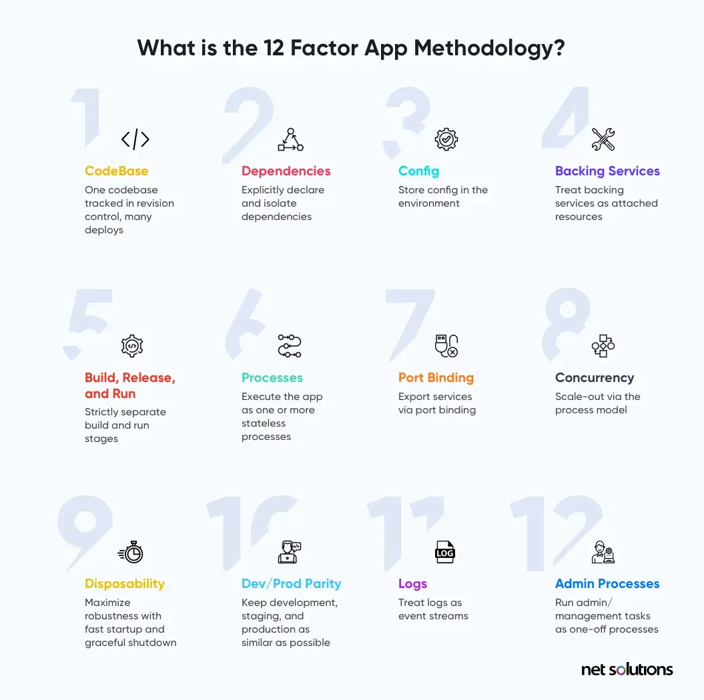
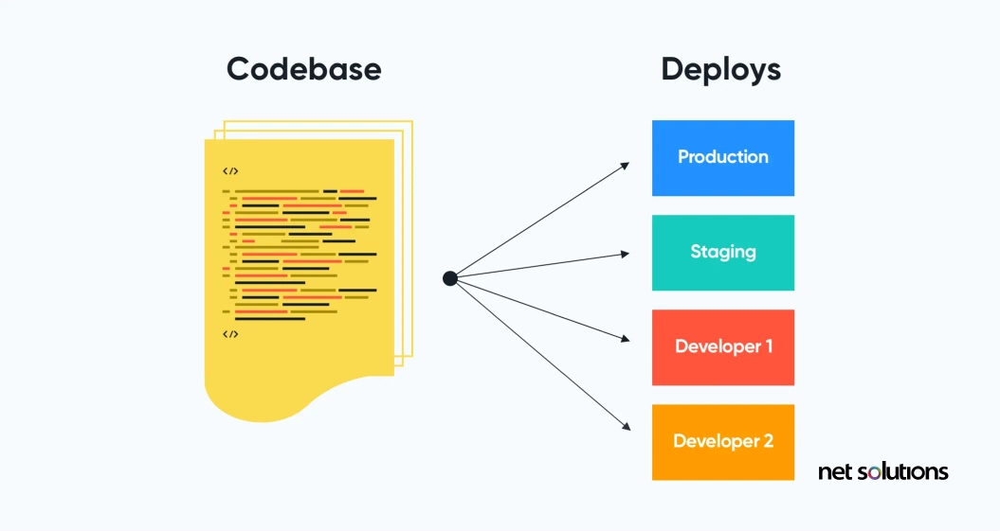
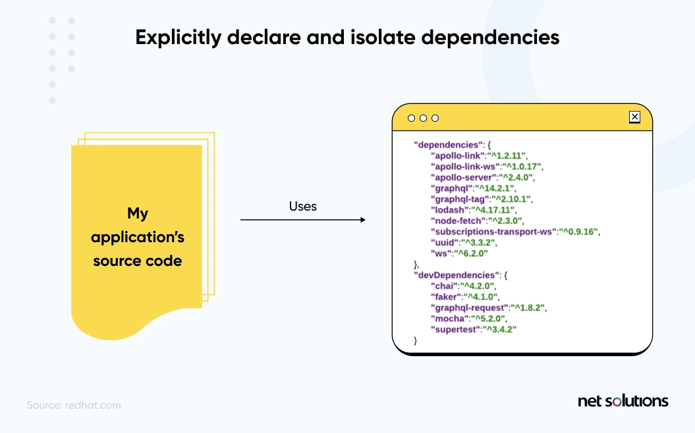
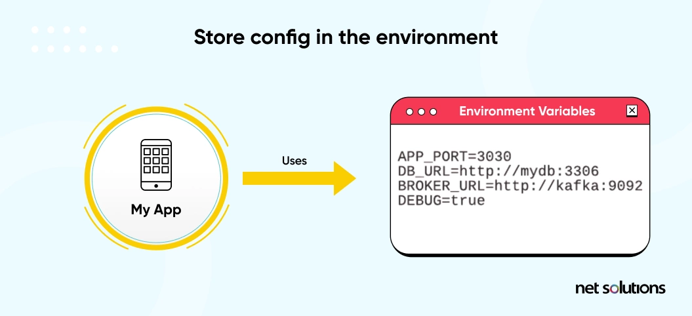
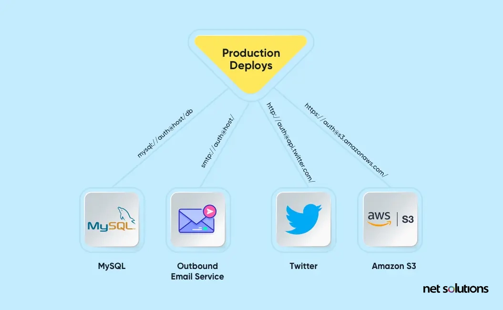
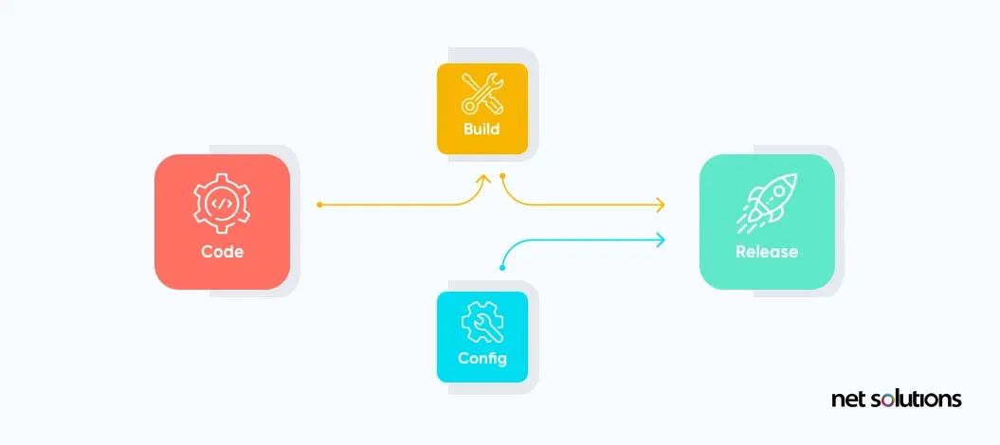
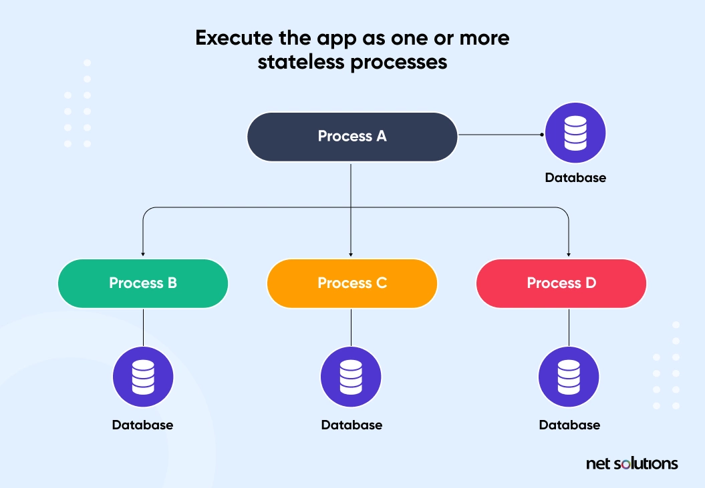
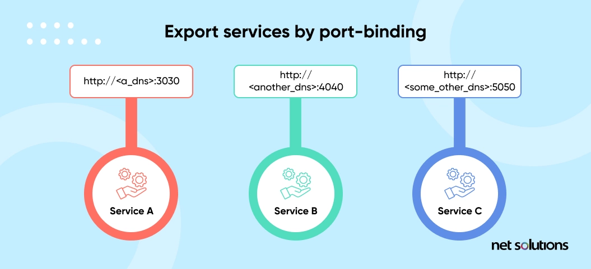
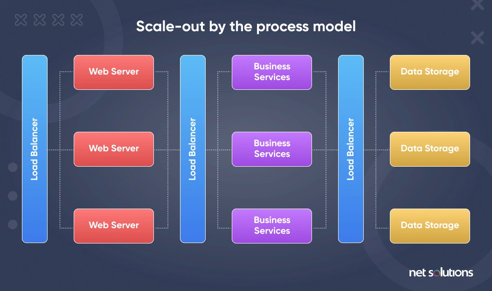

#  < 12 Factor 방법론 >


# 1. 12 Factor 방법론 개요


## 1) 12 Factor 방법론 이란 ?

최근 소프트웨어를 웹 기반의 서비스 형태로 제공하는 게 일반화되면서, 웹앱 혹은 SaaS(Software As A Service)라고 부르게 되었다. 

12Factor 앱 방법론은 Cloud 환경에서 안정적이고 탄력적인 SaaS(Soft As A Service) 애플리케이션을 구축하기 위한 12가지 원칙 집합이다.

12Factor 마이크로서비스 설계 원칙 또는 마이크로서비스의 12Factor 원칙이라고도 한다.





2012년 Heroku 의 개발자들이 확장 가능한 SaaS 앱 구축을 위해 12가지 원칙을 만들었다.

당시 개발자들은 아래와 같은 목표를 두었다.

*  시간이 경과함에 따라 망가지는 소프트웨어 유지비용을 줄이려면
* 동일한 앱의 코드베이스에서 작업하는 개발자 간의 협업을 향상시키기 위해
* 현대 앱 개발에서 발생하는 시스템적 문제에 대한 인식을 높이기 위해


## 2)  왜 12 Factor 방법론을 사용하나?

- 앱 개발 프로세스를  향상시키고 개발 비용을 최소한으로 낮출 수 있다.
- 쉽게 릴리즈 하고 빠르게 확장하며 일관되게 유지 관리할 수 있는 코드를 만드는데 도움이 된다.
- 프로젝트에 참여하는 새로운 개발자의 시간과 비용을 최소화 할 수 있다.
- 최신 클라우드 플랫폼에 신속하게 배포할 수 있어서 서버 및 시스템 관리가 필요하지 않게 된다.
- 아키텍처, 기술 스택 또는 개발 방식을 크게 변경하지 않고도 빠르게 확장할 수 있는 Application 을 만들 수 있다.


# 2. 12 Factors 상세


## 1) CodeBase

**: 다양한 배포를 위한 단일 통합 코드 저장소**





Code Base는  Git, SVN과 같은 버전 컨트롤 시스템(VCS)을 사용하여 변화를 추적하고 코드를 저장하는 저장소를 의미한다.

코드베이스와 App이 항상 1대1관계가 성립되어야 한다.  (코드는 한곳에서 개발/배포 되어야 한다.)

* 코드 베이스가 여러개인 경우
  * App이 아닌 분산 시스템으로 간주하고, 각각의 개별 구성요소가 App이 되며 각각 12-Factors 를 따른다.
* 여러개 앱이 동일한 코드를 공유하는 경우
  * 12-Factor를 위반하는 것으로 공유하는 코드를 라이브러리화 시키고, 해당 라이브러리를 종속성(Dependencies)으로 관리해야 한다.

* Application 배포가 여러개인 경우(dev/sit/prd 등)

  * 앱의 코드베이스는 한개여야 하지만, 앱 배포는 여러개가 될수 있습니다. 

  * 코드 베이스 자체는 동일하게 유지하며, Git Branch 등으로 동일한 앱을 여러개로 배포한다.

    


## 2) Dependencies(종속성)

**: 종속성을 명시적으로 선언하고 격리하라**




* 12-Factor App은 전체 시스템에 특정 패키지가 암묵적으로 존재하는 것에 절대 의존하지 않는다.
* Application의 모든 종속성은 명시적으로 선언해 사용해야 한다.
  * node.js 의 경우 **package.json** 이나 **.nvmrc** 에 명시하여 종속성을 관리
  * Java 프로젝트의 경우Gradle이나 Maven을 이용해서 의존성을 관리한다.

 


## 3) Config(설정)

**: 환경(Envirionment)별 설정값을 별도 관리 하라**





애플리케이션의 **Config(설정)**은 배포 (스테이징, 프로덕션, 개발 환경 등) 마다 달라질 수 있는 모든 것들을 의미한다. 아래는 예시이다.

- 데이터베이스 접속정보
- 백엔드 서비스들의 리소스 핸들
- API 또는 외부 서비스 인증 정보
- 서비스 포트 정보


종종 Application 에 설정을 상수로 코드를 저장하는 경우가 있는데 이는 12Factor 위반이다.

환경 변수는 코드 내부에 저장하지 않고 코드에서 엄격하게 분리해야 한다.

 

12Factor App은 **설정을 환경 변수(env or envvars)에 저장**한다.

* 환경 변수는 코드의 변경 없이 자유롭게 배포 및 변경이 가능해진다.
* 설정 파일과 달리 실수로 코드 저장소에 올라갈 가능성도 낮다.
* 언어나 OS 에 의존하지 않는 표준이다.

 

설정은 그룹핑을 용이하게 할 수 있다.

* 일반적으로 배포의 이름을 참고하여 그룹의 이름을 짓기도 한다.
  * 예를들면, development, test, production 이다.
  * Application 의 배포가 증가함에 따라 Stage 라던가 QA, SPT 와 같은 새로운 그룹의 이름이 필요하게 된다.


## 4) Backing Services(지원 서비스)

**: 백엔드 서비스를 연결된 리소스로 취급하라**




*백엔드 서비스*는 네트워크를 통해 이용하는 모든 서비스이며, 서드파티 서비스를 포함한다.

* 데이터 저장소(예: [MySQL](http://dev.mysql.com/), [CouchDB](http://couchdb.apache.org/)), 
* 메시지 큐잉 시스템(예: [RabbitMQ](http://www.rabbitmq.com/), [Beanstalkd](https://beanstalkd.github.io/)), 
* 메일을 보내기 위한 SMTP 서비스 (예: [Postfix](http://www.postfix.org/)), 
* 캐시 시스템(예: [Memcached](http://memcached.org/)) 

* 지표 수집 서비스 (예: [New Relic](http://newrelic.com/), [Loggly](http://www.loggly.com/)), 
* 스토리지 서비스 (예: [Amazon S3](http://aws.amazon.com/s3/)), 
* API로 접근 가능한 소비자 서비스 (예: [Twitter](http://dev.twitter.com/), [Google Maps](https://developers.google.com/maps/), [Last.fm](http://www.last.fm/api))


12 Factor App 에서는 이러한 백엔드 서비스들을 모두 연결된 리소스로 취급하고, 자유롭게 연결 및 분리가 가능해야 하고 코드 수정없이 전환이 가능해야 한다.

* 예를들면 
  * Config(설정)에 보관되어 있는 리소스별 인증정보를 사용하여 해당 리소스에 접근할 수 있어야 한다. 
  * 로컬에서 관리되는 MySQL DB를 서드파티에서 관리되는 DB(예: [Amazon RDS](http://aws.amazon.com/rds/))로 전환할 수 있어야 한다.
  * 로컬 SMTP 서버는 서드파티 SMTP 서비스(예: Postmark)로 코드 수정 없이 전환이 가능해야 한다.


* 리소스는 자유롭게 배포에 연결되거나 분리될 수 있어야 한다.
  * 데이터베이스가 하드웨어 이슈로 장애 발생한 경우의 시나리오
    * 애플리케이션의 관리자는 최신 백업에서 새로운 데이터베이스 서버를 시작시킬 것이다.
    * 그리고 코드를 전혀 수정하지 않고 현재 운영에 사용하고 있는 데이터베이스를 분리하여 새로운 데이터베이스를 연결 할 것이다.


## 5) Build, Release and Run

**: 빌드 및 실행 단계를 엄격하게 분리하라.**





코드베이스는 빌드, 릴리스 및 실행 의 3단계를 거쳐 배포로 변환된다. 

- **빌드 단계** 
  - 코드 베이스를 빌드라는 실행 가능한 번들로 변환시키는 단계
  - 커밋된 코드중 배포 프로세스에서 지정된 버젼을 사용하며, 종속성을 가져와 바이너리와 에셋들을 컴파일한다.
  - 새로운 코드가 배포될 때마다 개발자에 의해 시작
- **릴리스 단계** 
  - 빌드단계에서 만들어진 빌드와 현재 설정을 결합하는 단계
  - 실행환경에서 바로 실행될 수 있도록 준비한다.
- **실행 단계(런타임)** 
  - 선택된 릴리즈에 대한 Application 이 실행환경에 실행되도록 한다.
  - 실행 단계는 서버가 재부팅되거나 충돌이 발생한 프로세스가 프로세스 매니저에 의해 재시작 되었을 때 자동으로 실행될 수 있다.
    - 개발자가 없는 한밤중에 문제가 발생하는 것을 방지하기 위해 실행 단계에서는 최대한 변화가 적어야 한다.


12 Factor App 은 빌드, 릴리즈, 실행 단계를 엄격하게 서로 분리해야 한다. 

* 코드 변경은 반드시 빌드 단계에서만 이루어져야 한다.
  * 예를들어 실행단계에서는 코드를 변경할 수 없다. (변경을 실행 단계보다 앞인 빌드 단계로 전달할 수 없기 때문)
* 모든 릴리즈는 유니크한 릴리즈 아이디를 지녀야 한다. 한번 만들어진 릴리즈는 변경될 수 없고 항상 새로운 릴리즈를 만들어야 한다.
* 이전 버전으로 롤백이 가능해야 한다.


## 6) Process

**: 하나 이상의 Stateless Process로 앱을 실행하라.**




* Application 은 Stateless Process 로 실행되어야 한다. 

* 유지될 필요가 있는 데이터는 상태 저장지원 서비스(Database, Redis, Storage 등)에 저장되어야 한다.

* 이 원칙으로 인해 Scale-out 이 가능하게 해주며 확장성과 안정성을 높일 수 있다.

* "Sticky Session" 사용 사례

  * 웹시스템 중에서는 "Sticky Session" 에 의존하는 경우도 있다.
  * 유저의 세션 데이터를 Application 의 프로세스 메모리에 캐싱하고, 동일 유저 이후 요청도 동일 프로세스로 전달되는 형태이다.
  * 이런 사례는 12Factor 위반되는 사례이며 사용하거나 의존해서는 안된다.
  * 세션 상태 데이터는 Memcached 나 Redis 를 활용한 Session Clustering 패턴을 이용하는 것이 적합하다.

  


## 7) Port-Binding

**: 포트 바인딩을 사용해서 서비스를 노출하라.**





* 12-Factor 앱은 독립형 서비스로 작동해야 한다.
*  예를들면, 개발 환경에서 개발완료된 접근 서비스는  "http://localhost:5000" 과 같은 주소이지만 실행환경에서는 그  환경에 맞는 서비스로 Port binding 하여 노출해야 한다.
* 배포된 환경에서는 라우팅 레이어가 외부에 공개된 호스트명으로 들어온 요청을 해당 포트에 바인딩 된 웹 프로세스에 전달한다.


## 8) Concurrency(동시성)

**: Process 모델을 통한 확장**




* 12-Factor App에서 프로세스 모델
  * 아무것도 공유하지 않고(Stateless) 수평으로 확장이 가능해야 한다.
    * 이는 간단하고 안정적으로 Concurrency(동시성)을 높이는 작업이다.

  * 절대 데몬성으로 프로세스를 관리하면 안된다.
    * 대신 클라우드 플랫폼의 분산 프로세스 매니저에 의존하여 아웃풋 스트림 관리해야 하고
    *  프로세스 충돌에 대응하며 재시작과 종료 등을 처리할 수 있어야 한다.


## 9) Disposalbility(폐기 가능)

**: 빠른 시작과 Graceful shutdown 을 통한 안정성 극대화**


12 Factor App 에서는 프로세스의 시작과 종료, 배포가 빈번하기 때문에 Application 의 시작/종료시간을 최소화하는 것이 중요하다.

* Application은 즉시 시작하고 끝날 수 있어야 한다.
* 갑작스러운 오류나 앱 충돌에 강해야 한다. (Circuit breaker)
* 정상적으로 종료할 수 있어야 한다. (Graceful shutdown)

이러한 원칙은 신속한 코드 배포, 빠르고 탄력적인 확장, 릴리스 프로세스의 민첩성 향상, 강력한 프로덕션 배포 등 앱에 다양한 이점을 제공한다.


## 10) Dev/Prod Partiy

**: 개발, 스테이징, 프로덕션을 최대한 유사하게 유지하라**


일반적으로 개발환경과 Production 환경 사이에는 큰 차이가 있었다.  3가지 영역에 걸처 나타난다.

- **시간의 차이**: 개발자가 작업한 코드는 production에 반영되기까지 며칠, 몇주, 때로는 몇개월이 걸릴 수 있다.
- **담당자의 차이**: 개발자가 작성한 코드를 시스템 엔지니어가 배포한다.
- **툴의 차이**: 개발 및 프로덕션 환경에 사용되는 도구가 다를 수 있다.
  - production 배포는 아파치, MySQL, 리눅스를 사용하는데, 개발자는 Nginx, SQLite, OS X를 사용할 수 있다.


12 Factor App 은 개발환경과 Production 환경의 차이를 작게 유지하여 지속적인배포가 가능하도록 디자인 되었다.

|                                 | **전통적 애플리케이션** | **12-Factor App** |
| ------------------------------- | ----------------------- | ----------------- |
| **배포간의 간격**               | 몇 주                   | 몇 시간           |
| **코드 작성자와 배포자**        | 다른 사람               | 같은 사람         |
| **개발 환경과 production 환경** | 불일치                  | 최대한 유사함     |


* 배포간의 간격 축소
  * 시간 부분은 프로젝트가 길어질수록 기억을 잘 못할 수도 있으니 간격이 짧을수록 좋다. 또한 이슈에 상대적으로 더 잘 대응할 수 있다.

 

* 개발환경과 PRD환경 툴의 차이 

  * 개발자 입장에서는 프로덕션에서 사용하는 서비스보다 가벼운 환경을 구축해 개발하는 것을 원하는 경우가 많다.

  * 예를들면 아래와 같은 경우이다.

    * Production 에서는 PostgreSQL을 사용하는데 개발자 로컬에서는 SQLite 를 사용하는 경우

    * Production 에서는 MySQL인데 개발자 로컬에서는 H2사용하는 경우

    - https 적용 여부, 인증서 종류,  timeout 등


  * 개발 환경과 production 환경이 유사해야 하는 이유는 잠재적 위험 요소를 빠르게 파악할 수 있게 되기 때문입니다. 

  * 모든 Application 의 환경들은 같은 종류, 같은 버젼의 백엔드 서비스를 이용해야 한다.


## 11) Logs

**: 로그를 이벤트 스트림으로 처리하라**


* Application 은 로그의 전달이나 저장에 절대 관여하지 않아야 하며 별도의 이벤트 스트림으로 처리해야 한다.

* SaaS Application 은 언제든지 삭제되고 생성될 수 있으므로 로그는 스트림으로 취급해 별도 저장소에 보관해야 한다.


## 12) Admin Processes

**: admin/maintenance 작업을 일회성 프로세스로 실행**


* admin 또는 유지보수 작업을 일회성 프로세스(데이터베이스 마이그레이션,일회성 스크립트 실행 등)로 실행해야 한다.
* 일회성 admin 프로세스는 실행 환경에 내장된 도구를 사용하여 Application이 실행되는 동일한 환경에서 실행되어야 한다.
* 일회성 admin 프로세스는 Release를 기반으로 실행되므로 Application과 함께 배포되어야 한다.


참고링크

```
https://www.12factor.net/
https://www.netsolutions.com/insights/12-factor-app-methodology/
```
